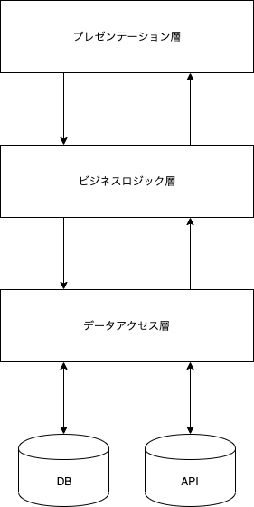
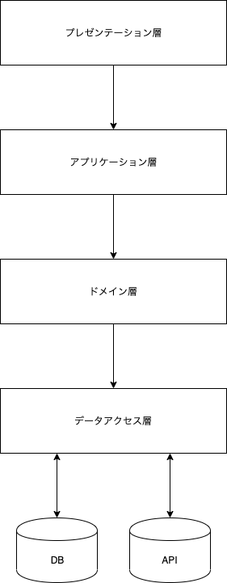

# アーキテクチャ

このプロジェクトでは、後述する4層アーキテクチャで実装しておりますが、より良いアーキテクチャを目指しています。

以下の参考記事がとてもわかりやすくまとめられているので、目を通しておくと良いと思います。

参考
* [MVC、3 層アーキテクチャから設計を学び始めるための基礎知識](https://qiita.com/os1ma/items/7a229585ebdd8b7d86c2)

## 3層アーキテクチャ
3層アーキテクチャは下記のように構成を3層に分割します。  


3層アーキテクチャでは下記の3つの関心ごとを分割するということが基本です。
* 表示上の関心 -> プレゼンテーション層
* コアなルール -> ビジネスロジック層
* データの問い合わせ・永続化 -> データアクセス層

### 例: じゃんけんアプリケーション  
ユーザの入力や結果の表示 -> プレゼンテーション層    
自分の手と相手の手を比較して勝敗を判断する -> ビジネスロジック層  
結果を保存 -> データアクセス層

## 4層アーキテクチャ
4層アーキテクチャではビジネスロジック層をアプリケーションとドメインに分割します。
実際のアプリケーションでは一つのシナリオで複数の業務ロジックを扱いたいということがあります。
業務ロジック自体はドメインに書いていき、アプリケーション層で複数のロジックを調整してシナリオを作ります。  
シナリオとロジックを分割することにより、ビジネスロジック層のオブジェクトの肥大化を防ぐことができます。



### 例: じゃんけんアプリケーション  
先ほどの3層の例では、相手の勝ち負けの比較しかしていなかったですが、実際には下記のようなロジックも必要になるはずです。
* アプリケーション側の手をだす戦略(ランダム？過去の統計？)
* 勝敗の比較

また、永続化データの問い合わせや保存も発生します。
じゃんけんをするという __1つのシナリオ__ で __2つの業務的な関心ごと__ と __データの問い合わせ・永続化__ を扱っています。アプリケーション層がそれらの関心ごとを扱うことで、業務ロジックの調整を行います。

```kotlin
@Service
class JankenService(private val jankenRepository: JankenRepository) {
    fun janken(userHand: Hand) {
        // 過去のじゃんけん履歴を取得
        val history: JankenHistory = jankenRepository.history()
        // 過去の履歴からアプリ側の手を決定
        val appHand: Hand = JankenStrategy(history).generateHand()
        // 勝敗を決定
        return JankenResult(userHand, appHand).also{
            // 結果を保存
            result -> jankenRepository.save(result)
        }  
    }
}
```

また、serviceに業務ロジックを書かないようにしましょう。
```kotlin
@Service
class JankenService(private val jankenRepository: JankenRepository) {
    fun janken(userHand: Hand) {
        // 過去のじゃんけん履歴を取得
        val history: JankenHistory = jankenRepository.history()
        // 過去の履歴からアプリ側の手を決定
        val appHand: Hand = JankenStrategy(history).generateHand()

        // NG: 勝敗の決定ロジックをサービスに書く
        if (userHand == appHand) {
            return Result.EVEN
        } else if(
            userHand == Hand.ROCK && appHand == Hand.SCISSORS
            || userHand == Hand.SCISSORS && appHand == Hand.PAPER
            || userHand == Hand.PAPER && appHand == Hand.ROCK
        ) {
            return Result.WIN
        } else {
            return Result.LOSE
        }
    }
}
```

> コメント  
サービスでif文がNGという訳ではないですが、true / falseの判断自体はドメインに任せて、その後のシナリオを変更するようになっていない場合はロジックである可能性が高いです。
```kotlin
@Service
class JankenService(private val jankenRepository: JankenRepository) {
    fun janken(userHand: Hand) {
        // 過去のじゃんけん履歴を取得
        val history: JankenHistory = jankenRepository.history()
        // 過去の履歴からアプリ側の手を決定
        val appHand: Hand = JankenStrategy(history).generateHand()

        // 勝敗を決定
        val result = JankenResult(userHand, appHand)
        if (result.isUserWin) { <-これはOK!        
            // ユーザが勝った時にだけする処理
            UserWinReward()...
        }

        return result
    }
}
```

